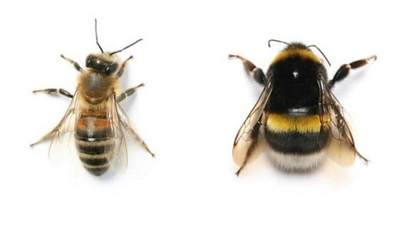

# Bees Species Classifier
Machine learning can be used to distinguish between honey bee and bumble bee. This project explores how deep learning can be used to identify bee species using famous machine learning library, Keras and scikit-learn. Around 1600 datasets will be used to train, test, and evaluate the model created for prediction.

## Tutorial
More detailed steps available on jupyter notebook:
1. Import python libraries: numpy, pandas, keras, scikit-learn
2. Load the DataFrame of labels and image names
3. Load the first image from DataFrame and examine
4. Normalize each feature of each image from datasets
5. Split the data into train, test, and evaluation sets
6. Build the first two layers of CNN
7. Finish building the CNN
8. Compile model and start train
9. Calculate accuracy and loss using evaluated pretrained model
10. Plot the validation accuracy and loss from model history
11. Predict the bees class
